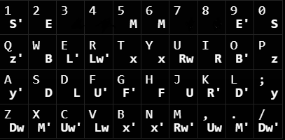

# RubiksCube

Virtual Cube with a timer. 

Coded in java with processing.

Press 'Space' to scramble the cube. The timer starts when you make your first turn. 
You can rotate the cube during inspection without starting the timer.

Key Map:

